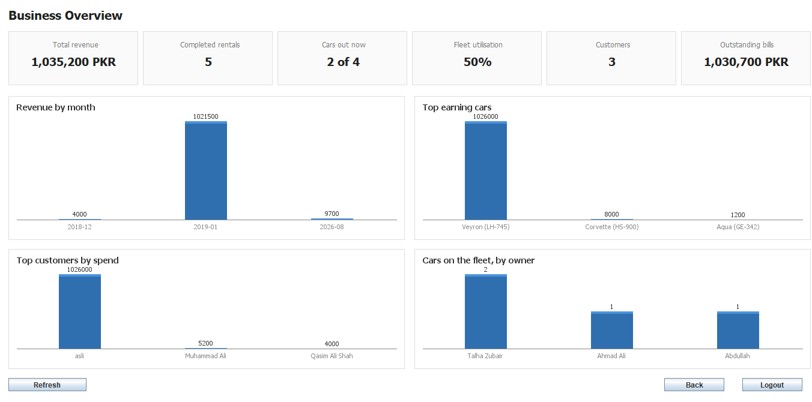
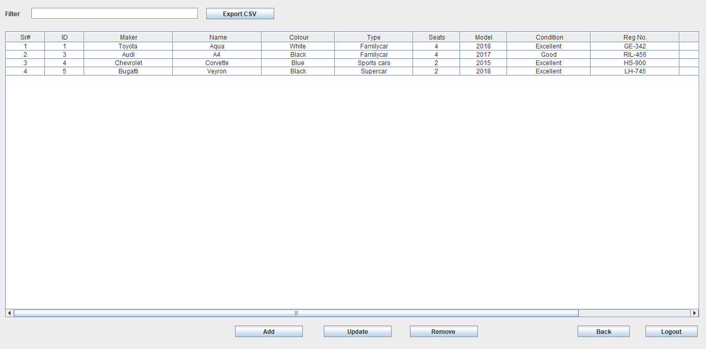
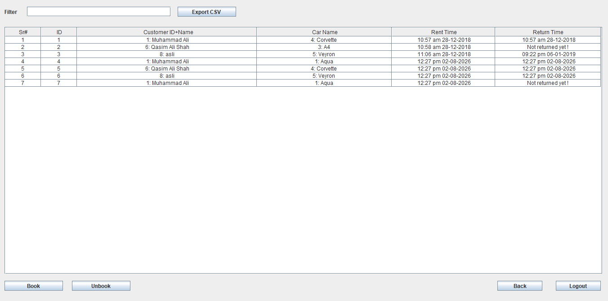
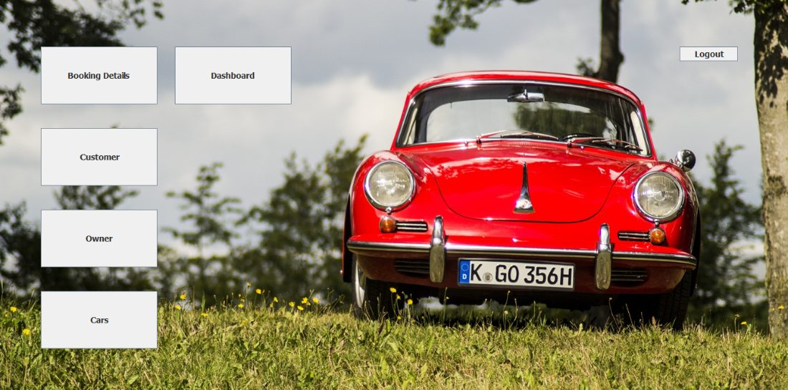
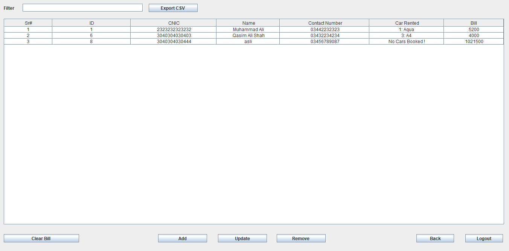
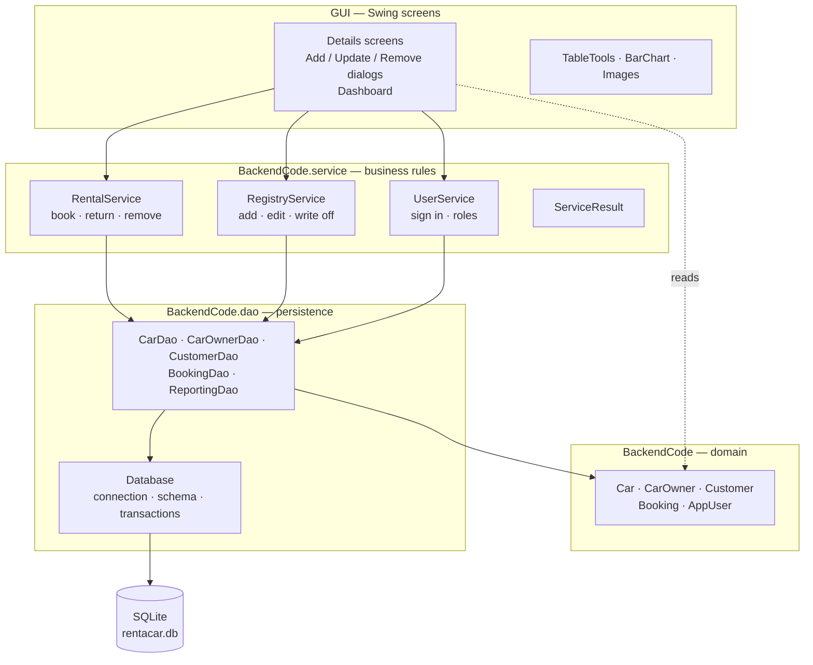

# Rent-A-Car Management System

[](../../actions/workflows/build.yml)


A Java desktop application for running a car rental business: the fleet, the owners who
supply it, the customers who rent from it, and the money that moves between them.
SQLite behind a DAO and service layer, 111 tests, CI on every push.



---

## Running it

Needs a JDK 21 or newer. Nothing else — no database to install, no IDE, no library to
register.

```bash
mvn clean package
java -jar target/rent-a-car.jar
```

Sign in with **`admin` / `123`**, created the first time the program runs against an
empty database. Change it before anyone else can reach the machine. Data lands in
`rentacar.db` in the working directory.

```bash
mvn verify     # 111 tests
```

---

## What it does

| | |
|---|---|
| **Fleet, owners, customers** | Add, edit and remove records, with the constraints enforced by the database rather than by hand |
| **Booking** | Rent a car out, take it back, and have the bill charged and the owner credited in one transaction |
| **Dashboard** | Revenue by month, top earning cars, top customers, fleet utilisation — all from aggregate SQL |
| **Filter and sort** | Every list narrows as you type and sorts on any column |
| **CSV export** | Writes exactly what you are looking at: the filtered rows, in the sorted order |
| **Roles** | Administrators can clear balances and delete accounts; staff cannot |

<table>
<tr>
<td width="50%"><br><em>The fleet, with live filtering</em></td>
<td width="50%"><br><em>Bookings, open and closed</em></td>
</tr>
<tr>
<td><br><em>Main menu</em></td>
<td><br><em>Customers and what they owe</em></td>
</tr>
</table>

---

## Architecture



The rule the layering exists to enforce: **screens do not touch the database, and they
do not decide business questions.** A screen validates the individual fields it can
point at, calls a service, and shows what the service decided. Everything that moves money runs inside one
transaction.

**Java 21 · Swing · SQLite (JDBC) · Maven · JUnit 5 · JaCoCo · SLF4J + Logback ·
BCrypt · GitHub Actions**

No IDE-specific project files and no dependency that has to be installed by hand — the
absolute-positioning layout manager the screens are built on lives in the source tree
rather than being pulled from an IDE-global library.

---

## The engineering

This started from an abandoned semester project: records kept as raw serialized Java
objects in four files, no tests, no CI, no dependency-managed build, and a classpath
that could only be resolved from inside one particular IDE installation.

I read all 24 source files, wrote up every defect I found, and rebuilt what was wrong.
**[ENGINEERING.md](ENGINEERING.md) is that write-up** — 37 defects with root cause, a
reproduction, the fix, and the recorded output for each. It also documents four
mistakes I made along the way, because the corrections are the useful part.

| | Before | Now |
|---|---|---|
| Storage | 4 files of serialized Java objects | SQLite with foreign keys and constraints |
| Build | NetBeans Ant, unresolvable classpath | `mvn clean package`, self-contained jar |
| Tests | none | 111, run on every push |
| Money | 3 loose writes in a button handler | one transaction, committed or rolled back |
| Errors | printed to a console nobody sees | logged, and reported on screen |
| Passwords | plaintext literals in the source | BCrypt hashes in the database |
| Search | a dialog with a `toString()` in it | live filtering and sorting |

The defect that best explains why the rewrite was worth doing: a booking stored its own
frozen copies of the customer and the car. Returning a car added the bill to *that*
copy's balance and wrote it back, so a second rental silently erased the earnings of the
first — two rentals worth 200 and 400 left the owner with 400. Rows referencing rows by
id made the whole class of bug impossible rather than patched.

Written from scratch during the rebuild: the persistence layer (`Database`, five DAOs,
the schema and its migration), the service layer (`RentalService`, `RegistryService`,
`UserService`, `ServiceResult`), the reporting and dashboard (`ReportingDao`, `Dashboard`, `BarChart`),
the table tooling (`TableTools`), the legacy importer (`SerImporter`), the vendored
layout manager, and the whole test suite.

---

## Known limitations

- **Bookings are instant, not scheduled.** You rent a car now and return it now; there
  is no reserving one for next Tuesday. That is the largest gap in the domain model.
- **The Swing screens have no automated tests.** They are about 4,000 of the 6,700 lines
  here. Driving them would need a UI-testing library for little return, so coverage is
  reported over the model, service and DAO layers, which is what the suite actually
  exercises. The screens were checked by hand.
- **Single user, single machine.** One SQLite file, one connection, no networking.

---

## Credits and licence

Built on the original Rent-A-Car Management System by **Abdullah Shahid**
([@AbdullahShahid01](https://github.com/AbdullahShahid01)), with a contribution from
[@SaadBinAbiWaqas](https://github.com/SaadBinAbiWaqas). Their commits are preserved in
this repository's history, and the files they wrote keep their `@author` tags; the
files listed above as written during the rebuild carry mine.

The rebuild is [MIT licensed](LICENSE). That grant covers the files tagged
`@author @Barath-Grama` plus the documentation, build and tests — it does **not** cover
the 14 inherited files. The original project was published without a licence, so
copyright in those remains with its authors and none is granted here. If you want to
reuse the project as a whole, please approach the original author.
