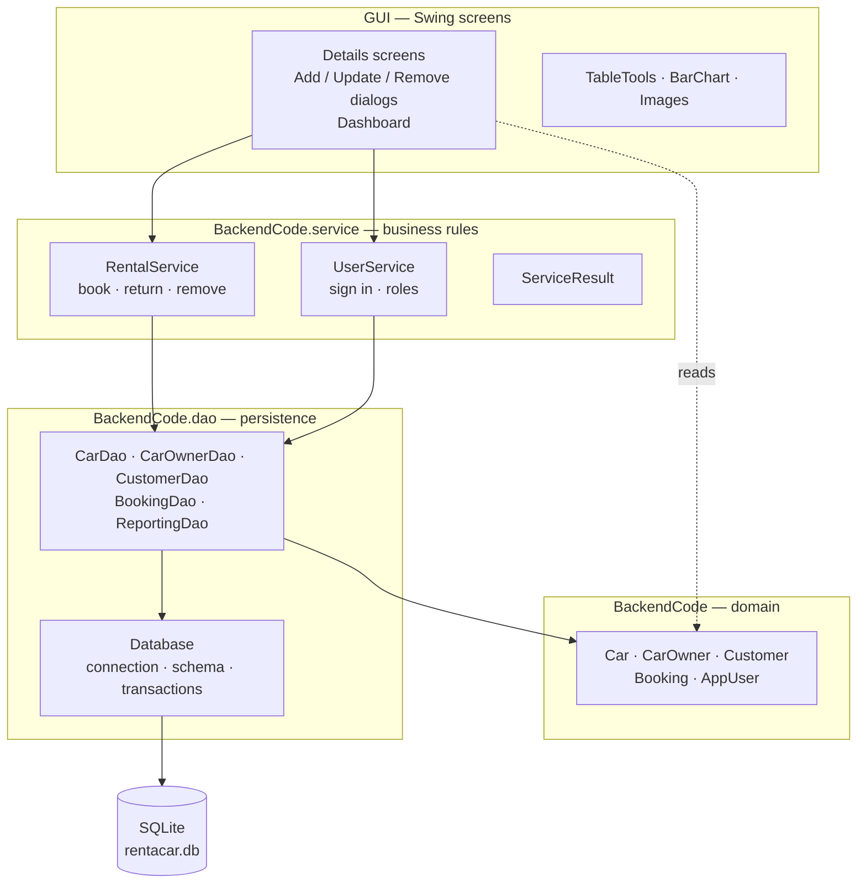

# Rent-A-Car Management System

[](../../actions/workflows/build.yml)


A Java Swing desktop application for running a car rental business: the fleet, the
owners who supply it, the customers who rent from it, and the money that moves between
them.


---

## What this repository is

It began as [AbdullahShahid01/Rent-a-Car-Management-System](https://github.com/AbdullahShahid01/Rent-a-Car-Management-System),
a semester OOP project whose README declared it unmaintained. That version stored its
records as raw serialized Java objects in four files, had no tests, no continuous
integration and no dependency-managed build, and could only be compiled from inside a
NetBeans installation that happened to have a particular IDE library registered.

I read all 24 source files, wrote up the defects I found, and rebuilt the parts that
were wrong. **[ENGINEERING.md](ENGINEERING.md) is the write-up** — 37 defects with
their root cause, a reproduction, the fix, and the evidence for each. If you only read
one thing here, read that.

Original author: **Abdullah Shahid** ([@AbdullahShahid01](https://github.com/AbdullahShahid01)),
with a contribution from [@SaadBinAbiWaqas](https://github.com/SaadBinAbiWaqas).
Everything described under *What changed* below is my work.

---

## Running it

Needs a JDK 21 or newer. Nothing else — no database to install, no IDE, no
library to register.

```bash
mvn clean package
java -jar target/rent-a-car.jar
```

Sign in with **`admin` / `123`**. That account is created the first time the program
runs against an empty database; change its password before anyone else can reach the
machine. Data lands in `rentacar.db` in the working directory, and the first run
imports any legacy `.ser` files it finds beside it.

Run the tests with:

```bash
mvn verify
```

---

## What it does

| | |
|---|---|
| **Fleet, owners, customers** | Add, edit and remove records, with the constraints enforced by the database rather than by hand |
| **Booking** | Rent a car to a customer, take it back, and have the bill charged and the owner credited in one transaction |
| **Dashboard** | Revenue by month, top earning cars, top customers, fleet utilisation — all from aggregate SQL |
| **Filter and sort** | Every list narrows as you type and sorts on any column |
| **CSV export** | Writes exactly what you are looking at: the filtered rows, in the sorted order |
| **Roles** | Administrators can clear balances and delete accounts; staff cannot |

<table>
<tr>
<td width="50%"><br><em>The fleet, with live filtering</em></td>
<td width="50%"><br><em>Bookings, open and closed</em></td>
</tr>
<tr>
<td><br><em>Main menu</em></td>
<td><br><em>Customers and what they owe</em></td>
</tr>
</table>

---

## How it is put together



The rule the layering exists to enforce: **screens do not touch the database, and they
do not decide business questions.** A screen validates what was typed, calls a service,
and shows what the service decided. Everything that moves money runs inside one
transaction.

### Tech

Java 21 · Swing · SQLite (JDBC) · Maven · JUnit 5 · JaCoCo · SLF4J + Logback ·
BCrypt · GitHub Actions

No IDE-specific project files, and no external dependency that has to be installed by
hand — the absolute-positioning layout manager the screens are built on lives in the
source tree precisely because relying on an IDE-global library is what made the
original unbuildable outside NetBeans.

---

## What changed

| | Before | Now |
|---|---|---|
| Storage | 4 files of serialized Java objects | SQLite with foreign keys and constraints |
| Build | NetBeans Ant, unresolvable classpath | `mvn clean package`, self-contained jar |
| Tests | none | 85, run on every push |
| Money | 3 loose writes in a button handler | one transaction, committed or rolled back |
| Errors | printed to a console nobody sees | logged, and reported on screen |
| Passwords | plaintext literals in the source | BCrypt hashes in the database |
| Search | a dialog with a `toString()` in it | live filtering and sorting |

The defect that best explains why the rewrite was worth doing: a booking stored its own
frozen copies of the customer and the car. Returning a car added the bill to *that*
copy's balance and wrote it back, so a second rental silently erased the earnings of
the first. Two rentals worth 200 and 400 left the owner with 400. Rows referencing rows
by id made the whole class of bug impossible rather than patched.

---

## Known limitations

- **Bookings are instant, not scheduled.** You rent a car now and return it now; there
  is no reserving one for next Tuesday. That is the largest thing the domain model is
  missing.
- **The Swing screens have no automated tests.** They are about 4,000 of the 6,700
  lines here. Driving them would need a UI-testing library for little return, so
  coverage is reported over the model, service and DAO layers, which is what the suite
  actually exercises. The screens were checked by hand.
- **Single user, single machine.** One SQLite file, one connection, no networking.
- **Two result conventions.** Screens that call a service read a `ServiceResult`;
  the Add and Update dialogs still call the model directly and check a boolean through
  `SaveReport`. They should be one thing.

---

## Licence and credit

The original project carried no licence file. This fork keeps the original author's
`@author` tags on the files they wrote. Please credit Abdullah Shahid for the original
work if you use it.
